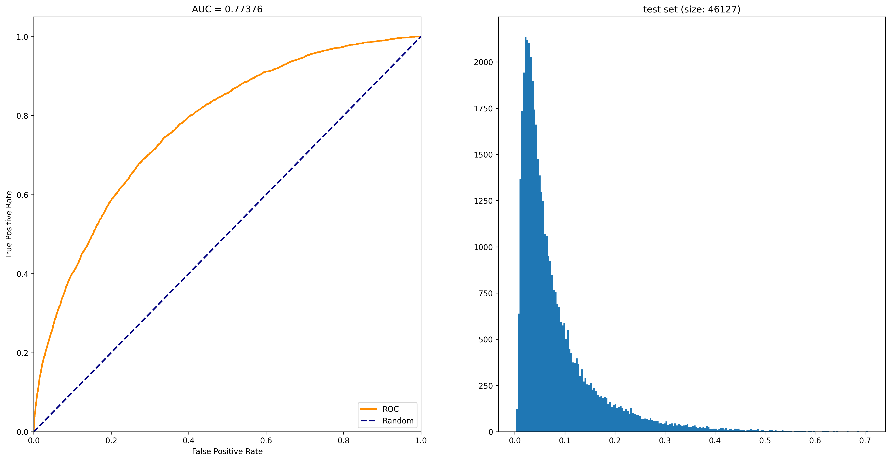

# Home Credit Default Risk Competition
The objective of this competition is to use historical loan application data to predict whether or not an applicant will be able to repay a loan.

Visit to [here](https://www.kaggle.com/c/home-credit-default-risk/data) for downloading Data from Kaggle. After downloading, extract and copy into main folder.

**There are two parts of repository**: 
1. process_and_modeling.ipynb is used for processing data and training model XGBosst
2. analyis_and_report.ipynb is used for analysis data and report

In this repository, i used **Python** as my main tool for processing and analyzing data. 

The image above is the result of the training model process. 